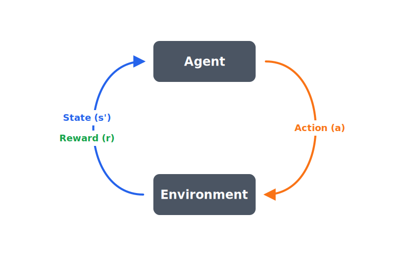

# Week 01 - MDPs and Baselines

## Objectives

By the end of this week, learners should be able to:

- Define state, action, reward, transition, and termination.
- Explain why a random policy is useful.
- Read a simple environment loop.
- Distinguish "the agent failed" from "the environment is ill-defined."

## Core Idea

Reinforcement learning starts with an interaction loop:

1. The agent observes a state.
2. The agent chooses an action.
3. The environment returns the next state, reward, and done signal.
4. The process repeats until the episode ends.

Before adding neural networks, simulators, or foundation models, the loop must
be inspectable.

## Visual Artifact

## Mini Example

In `examples/week-01/01_random_policy.py`, the state is the agent position in
a 1D world (the environment itself lives in `examples/week-01/env.py`). The
actions are left and right. The reward is `-0.01` for each non-goal move and
`+1.0` for reaching the goal.

This tiny setup is deliberately small. It lets us see the full rollout, line by
line, before hiding the environment behind a framework.

## Discussion Questions

1. Why does the non-goal step penalty encourage shorter paths?
2. What would happen if the goal reward were also `-0.01`?
3. Why is timeout termination important?
4. What information would a robot arm reaching task need in its state?
5. What would be a bad reward function for a robot reaching task?

## Bridge to Robotics

For a robot reaching task, the same MDP questions remain:

- State might include joint angles, end-effector pose, target pose, and camera
  observations.
- Action might be joint velocity, torque, end-effector delta pose, or a higher
  level skill command.
- Reward might combine distance-to-target, task completion, collision penalties,
  and control smoothness.
- Termination might happen on success, collision, timeout, or unsafe state.

The algorithm matters, but the MDP usually decides whether learning is possible.
